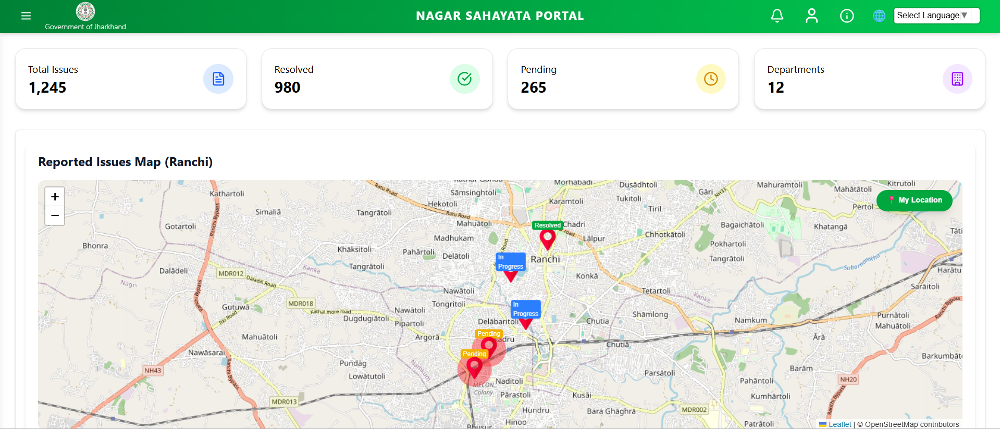

<h1 align="center">🚀 Nagar-Sahayata-Portal (MERN)</h1>

A smart platform where citizens can report local issues, and authorities can track, manage, and resolve complaints efficiently.

  

  
  
  
  

---

## 🏙️ Overview

**Nagar-Sahayata-Portal** helps citizens raise complaints about social and civic issues.  
Authorities manage them using **role-based dashboards**:

- 👤 User — submit complaints  
- 🛠️ Staff / Junior Staff — manage assigned complaints  
- 🧑‍💼 Admin — monitor, assign & control  

Built with the **MERN Stack**.

---

## ✨ Features

- 📢 Complaint submission with images  
- 🧭 Role-based dashboards  
- 📍 Area-wise complaint tracking  
- 🔐 Secure JWT authentication  
- 📧 Email notifications  
- 📊 Status: Pending → In-Progress → Resolved  

---

## 🛠️ Tech Stack

| Layer | Tech |
|------|------|
| Frontend | React |
| Backend | Node.js + Express |
| Database | MongoDB Atlas |
| Auth | JWT |
| Email | Nodemailer |

---

## 📸 Screens

  
    
  

---

## 🚀 Getting Started

### 1️⃣ Clone the repository
`bash
git clone https://github.com/abhay963/Nagar-Sahayata-Portal.git
cd Nagar-Sahayata-Portal
2️⃣ Install dependencies
bash
Copy code
# Frontend
cd client
npm install

# Backend
cd ../server
npm install
🔐 Environment Variables
Create .env inside server:

env
Copy code
MONGO_URI_AUTH=your_auth_db_connection_string
MONGO_URI_REPORTS=your_reports_db_connection_string

JWT_SECRET=your_super_secret_key
PORT=5000

EMAIL_USER=your_email@gmail.com
EMAIL_PASS=your_app_password_here
💡 Keep .env private — add it to .gitignore.

▶️ Run the project
Backend
bash
Copy code
cd server
npm run dev
Frontend
bash
Copy code
cd client
npm start
👥 Roles & Permissions
Role	Permissions
👤 User	Submit & track complaints
🛠️ Staff	Manage assigned complaints
🧑‍🏫 Junior Staff	Update progress
🧑‍💼 Admin	Full Control

🌍 Deployment (optional)
Frontend → Netlify / Vercel

Backend → Render / Railway

DB → MongoDB Atlas

👥 Contributors

  
 
 <em>Thanks to everyone who contributed to Nagar-Sahayata-Portal!</em> 

🤝 Contributing
Pull requests and suggestions are welcome!

⭐ Support
If you like this project, please ⭐ the repo — it helps a lot.

Happy coding! 💡

yaml
Copy code

---

# 🎞️ Animated Contributors (how it works)

## 👥 Contributors

  <a href="https://github.com/abhay963">
    
     
    <b>Abhay Kumar Yadav</b>
  </a>

  <a href="https://github.com/Aditi-Raj07">
    
     
    <b>Teammate Name</b>
  </a>

