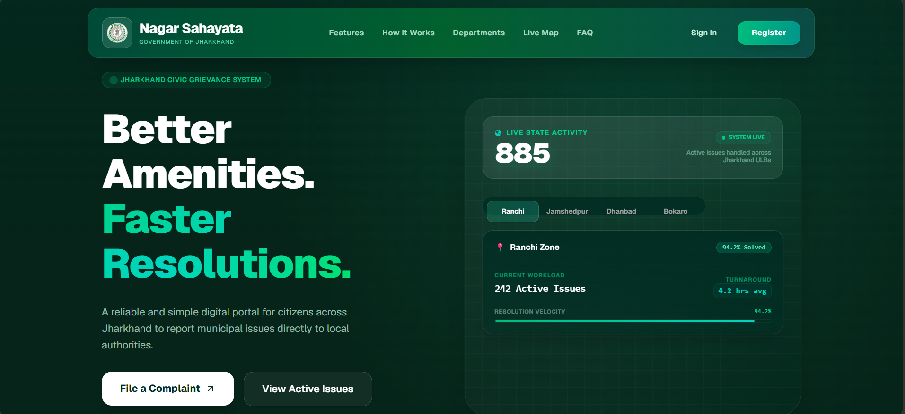
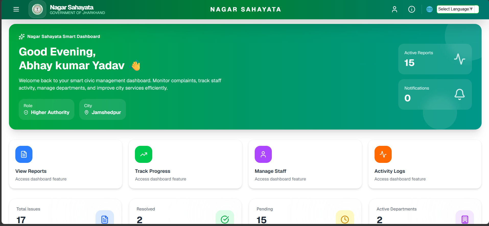
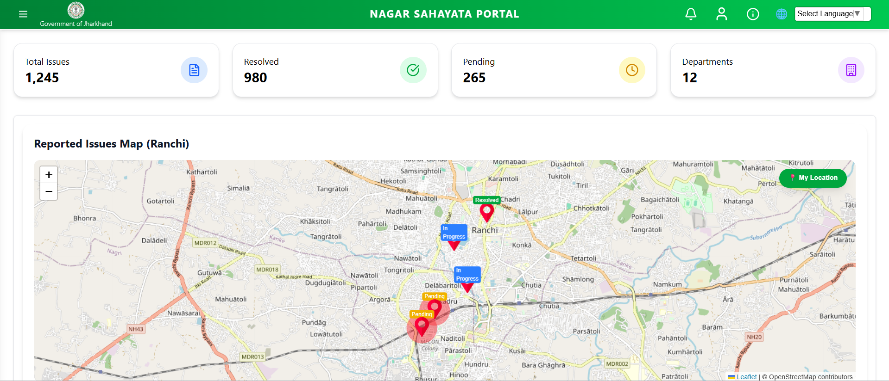

<h1 align="center">🚀 Nagar-Sahayata-Portal (MERN)</h1>

<p align="center">
A smart platform where citizens can report local issues, and authorities can track, manage, and resolve complaints efficiently.
</p>

<p align="center">
  
</p>

<p align="center">
  
  
  
  
</p>

---

## 🏙️ Overview

**Nagar-Sahayata-Portal** helps citizens raise complaints about social and civic issues.  
Authorities manage them using **role-based dashboards**:

- 👤 **User** — submit complaints  
- 🛠️ **Staff / Junior Staff** — manage assigned complaints  
- 🧑‍💼 **Admin** — monitor, assign & control  

Built with the **MERN Stack**.

---

## ✨ Features

- 📢 Complaint submission with images  
- 🧭 Role-based dashboards  
- 📍 Area-wise complaint tracking  
- 🔐 Secure JWT authentication  
- 📧 Email notifications  
- 📊 Status flow: **Pending → In-Progress → Resolved**

---

## 🛠️ Tech Stack

| Layer | Tech |
|------|------|
| Frontend | React |
| Backend | Node.js + Express |
| Database | MongoDB Atlas |
| Auth | JWT |
| Email | Nodemailer |

---

## 📸 Screens

<p align="center">
 
  <br/><br/>
  
  <br/><br/>
  
  <br/><br/>
  
</p>

---

## 🚀 Getting Started

### 1️⃣ Clone the repo
```bash
git clone https://github.com/abhay963/Nagar-Sahayata-Portal.git
cd Nagar-Sahayata-Portal
2️⃣ Install dependencies
bash
Copy code
# Frontend
cd client && npm install

# Backend
cd ../server && npm install
3️⃣ Create environment file
Create a .env inside server:

env
Copy code
MONGO_URI_AUTH=your_auth_db_connection_string
MONGO_URI_REPORTS=your_reports_db_connection_string
JWT_SECRET=your_super_secret_key
PORT=5000
EMAIL_USER=your_email@gmail.com
EMAIL_PASS=your_app_password_here
💡 Tip: Keep .env private (add it to .gitignore).

4️⃣ Run the project
bash
Copy code
# Backend
cd server
npm run dev

# Frontend
cd ../client
npm start

```
## 👥 Contributors

<table align="center">
  <tr>
    <td align="center">
      <a href="https://github.com/Aditi-Raj07">
        <br/>
        <sub><b>Aditi Raj</b></sub>
      </a>
    </td>
    <td align="center">
      <a href="https://github.com/adityakumar5492">
        <br/>
        <sub><b>Aditya Kumar</b></sub>
      </a>
    </td>
    <td align="center">
      <a href="https://github.com/Akshat-shukla18">
        <br/>
        <sub><b>Akshat Shukla</b></sub>
      </a>
    </td>
  </tr>

  <tr>
    <td align="center">
      <a href="https://github.com/Aashi008">
        <br/>
        <sub><b>Aashi</b></sub>
      </a>
    </td>
    <td align="center">
      <a href="https://github.com/amandubey923">
        <br/>
        <sub><b>Aman Dubey</b></sub>
      </a>
    </td>
    <td align="center">
      <a href="https://github.com/abhay963">
        <br/>
        <sub><b>Abhay Kumar</b></sub>
      </a>
    </td>
  </tr>
</table>

<p align="center">
  <em>Built with collaboration, dedication & teamwork 🚀</em>
</p>


<p align="center">
  <marquee><b>Happy coding! 💡</b></marquee>
</p>
